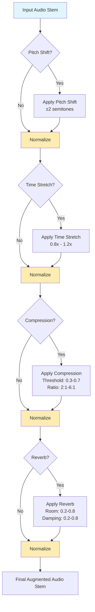
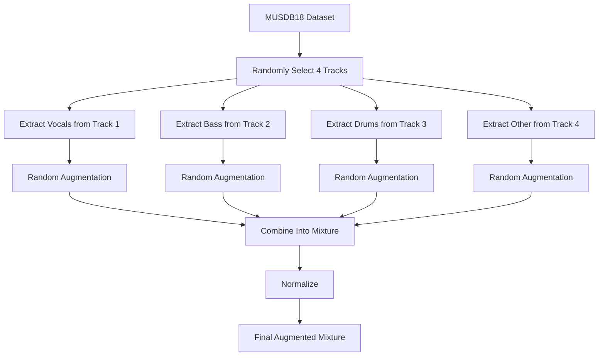
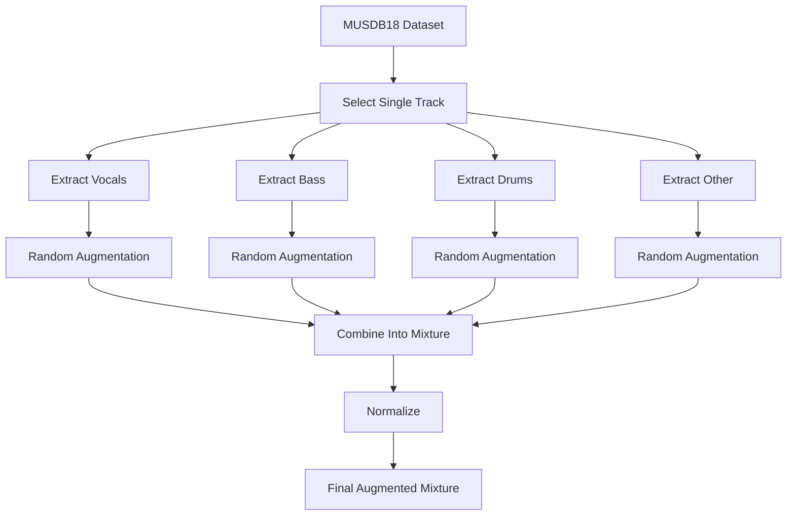

# STMAE_music_source_separation
In this repository the implementation develop for the final project of the Selected Topics in Music and Acoustic Enginnering subject can be seen.

# Introduce

This project focuses on Music Source Separation (MSS), which decomposes a mixed music signal into independent components such as vocals, drums, bass, and accompaniment—crucial for remixing, automatic transcription, and music education. We enhance the BandSplitRNN (BSRNN) model by integrating Squeeze‑and‑Excitation (SE) attention layers to improve its ability to focus on key time–frequency features. Additionally, we implement a lightweight U‑Net inspired by TFC‑TDF‑UNet v3 to evaluate performance in resource‑constrained environments. These complementary approaches explore the trade‑off between model complexity and separation quality.

# Audio Augmentation Pipelines for MUSDB18

## 1. Single Stem Random Augmentation

```mermaid
flowchart LR
    A[Input Audio Stem] --> C1{Pitch Shift?}
    C1 -->|Yes| D1[Apply Pitch Shift<br/>±2 semitones]
    C1 -->|No| N1[Normalize]
    D1 --> N1[Normalize]
    
    N1 --> C2{Time Stretch?}
    C2 -->|Yes| D2[Apply Time Stretch<br/>0.8x - 1.2x]
    C2 -->|No| N2[Normalize]
    D2 --> N2[Normalize]
 
    N2 --> C3{Compression?}
    C3 -->|Yes| D3[Apply Compression<br/>Threshold: 0.3-0.7<br/>Ratio: 2:1-6:1]
    C3 -->|No| N3[Normalize]
    D3 --> N3[Normalize]

    N3 --> C4{Reverb?}
    C4 -->|Yes| D4[Apply Reverb<br/>Room: 0.2-0.8<br/>Damping: 0.2-0.8]
    C4 -->|No| N4[Normalize]
    D4 --> N4[Normalize]
    
    N4 --> G[Final Augmented Audio Stem]
 style A fill:#e1f5fe
style N1 fill:#ffecb3
style N2 fill:#ffecb3
style N3 fill:#ffecb3
style N4 fill:#ffecb3
```

## 1.5 Top Down layed out pipeline

## 2. Incoherent Augmentation Pipeline

This pipeline combines stems from multiple tracks to create novel mixtures.

## 3. Coherent Augmentation Pieline

This pipelines combines stems from a single track to create novel mixtures.

# Models

## 1. SE‑Enhanced BandSplitRNN
### Key Idea
Builds on the original BandSplitRNN (BSRNN) by adding Squeeze‑and‑Excitation (SE) layers after each residual block. These channel‑wise attention modules automatically reweight feature channels, improving the model’s focus on critical time–frequency information.

### Architecture
- Sub‑Band Split: Partition the input STFT spectrogram into several non‑overlapping sub‑bands and project each into a shared feature space.
- Dual‑Path BLSTM: Apply bidirectional LSTMs alternately over the time and frequency dimensions, with residual connections across blocks.
- Mask Estimation: Use sub‑band–specific MLPs followed by a GLU to predict complex masks and reconstruct the full spectrogram.

### Parameter Count
Approximately 32.5 M parameters; the added SE layers incur a negligible increase while delivering significant performance gains.

### References
- paper: https://arxiv.org/abs/2209.15174
- pytorch implementation: https://github.com/amanteur/BandSplitRNN-Pytorch

## 2. Lightweight U‑Net
### Key Idea
Inspired by TFC‑TDF‑UNet v3, this model uses a standard U‑Net encoder–bottleneck–decoder backbone with reduced depth and channel counts, making it trainable on a single GPU (e.g., GTX 1650).

### Architecture
- Encoder: 3 blocks of Conv2D → BatchNorm → ReLU → MaxPool, with filter sizes 8 → 16 → 32
- Bottleneck: Conv2D with 64 channels + Dropout(0.3)
- Decoder: Conv2DTranspose layers with skip connections + Dropout(0.2)
- Output: 1×1 convolution to predict the magnitude spectrogram, then combine with the mixture phase for iSTFT reconstruction

### References
- TFC‑TDF‑UNet v3 paper: https://arxiv.org/abs/2211.08553
- Example implementation: https://github.com/jianchang512/vocal-separate

