# Audio Augmentation Pipelines for MUSDB18

This folder contains all the scripts to perform data augmentation on the MUSDB18 Dataset. WE provide below the implemented pipelines for more clarity. 

Make sure to update the dataset's path as well as the output directories paths (augmented audio files) for the code tu run well.

## 1. Single Stem Random Augmentation

```mermaid
flowchart LR
    A[Input Audio Stem] --> C1{Pitch Shift?}
    C1 -->|Yes| D1[Apply Pitch Shift<br/>±2 semitones]
    C1 -->|No| N1[Normalize]
    D1 --> N1[Normalize]
    
    N1 --> C2{Time Stretch?}
    C2 -->|Yes| D2[Apply Time Stretch<br/>0.8x - 1.2x]
    C2 -->|No| N2[Normalize]
    D2 --> N2[Normalize]
 
    N2 --> C3{Compression?}
    C3 -->|Yes| D3[Apply Compression<br/>Threshold: 0.3-0.7<br/>Ratio: 2:1-6:1]
    C3 -->|No| N3[Normalize]
    D3 --> N3[Normalize]

    N3 --> C4{Reverb?}
    C4 -->|Yes| D4[Apply Reverb<br/>Room: 0.2-0.8<br/>Damping: 0.2-0.8]
    C4 -->|No| N4[Normalize]
    D4 --> N4[Normalize]
    
    N4 --> G[Final Augmented Audio Stem]
 style A fill:#e1f5fe
style N1 fill:#ffecb3
style N2 fill:#ffecb3
style N3 fill:#ffecb3
style N4 fill:#ffecb3
```

## 2. Incoherent Augmentation Pipeline

This pipeline combines stems from multiple tracks to create novel mixtures.

## 3. Coherent Augmentation Pieline

This pipelines combines stems from a single track to create novel mixtures.

