```mermaid
flowchart LR
    A[Input Audio Stem] --> C1{Pitch Shift?}
    C1 -->|Yes| D1[Apply Pitch Shift<br/>±2 semitones]
    C1 -->|No| N1[Normalize]
    D1 --> N1[Normalize]
    
    N1 --> C2{Time Stretch?}
    C2 -->|Yes| D2[Apply Time Stretch<br/>0.8x - 1.2x]
    C2 -->|No| N2[Normalize]
    D2 --> N2[Normalize]
 
    N2 --> C3{Compression?}
    C3 -->|Yes| D3[Apply Compression<br/>Threshold: 0.3-0.7<br/>Ratio: 2:1-6:1]
    C3 -->|No| N3[Normalize]
    D3 --> N3[Normalize]

    N3 --> C4{Reverb?}
    C4 -->|Yes| D4[Apply Reverb<br/>Room: 0.2-0.8<br/>Damping: 0.2-0.8]
    C4 -->|No| N4[Normalize]
    D4 --> N4[Normalize]
    
    N4 --> G[Final Augmented Audio Stem]
 style A fill:#e1f5fe
style N1 fill:#ffecb3
style N2 fill:#ffecb3
style N3 fill:#ffecb3
style N4 fill:#ffecb3
```

# Overview
The <b>MUSDB18_Audio_Data_Augmentation.ipynb</b>  notebook provides a complete pipeline for augmenting audio data from the MUSDB18 dataset, which is widely used for music source separation tasks. The system extracts individual instrument stems (vocals, drums, bass, other) from music tracks and applies various audio augmentation techniques to generate synthetic training data.

# Features
- Dataset Integration: Seamless loading and processing of MUSDB18 dataset
- Mono Conversion: Automatic stereo-to-mono conversion for simplified processing
- Multi-stem Processing: Individual handling of vocals, drums, bass, and other instrument tracks
- Audio Quality Assessment: Automatic validation of audio segments for energy and activity levels
Audio Augmentation Techniques
- Pitch Shifting: Transpose audio by specified semitones (-2 to +2 semitones)
- Time Stretching: Modify playback speed while preserving pitch (0.8x to 1.2x)
- Dynamic Range Compression: Apply audio compression with configurable threshold and ratio
- Reverb Effects: Add spatial ambience with adjustable room size and damping parameters

# Augmentation Strategies
Coherent Augmentation (Fixed Parameters): Apply identical augmentation parameters across all stems from the same track
Semi-Coherent Augmentation (Varying Parameters): Apply different random augmentations to each stem from the same track
Incoherent Augmentation: Combine stems from different tracks with individual augmentations

## Single Stem Random Augmentation Module

## Incoherent Augmentation Pipeline

This pipeline combines stems from multiple tracks to create novel mixtures.

## Coherent Augmentation Pieline

This pipelines combines stems from a single track to create novel mixtures.

# Paths to check
Make sure you update the paths in the config object to match the targeted directories location on your machine.
- MUSDB18_PATH = "/path/to/musdb18"
- OUTPUT_DIR_COHERENT_MIX = "/path/to/coherent/output"
- OUTPUT_DIR_INCOHERENT_MIX = "/path/to/incoherent/output"

